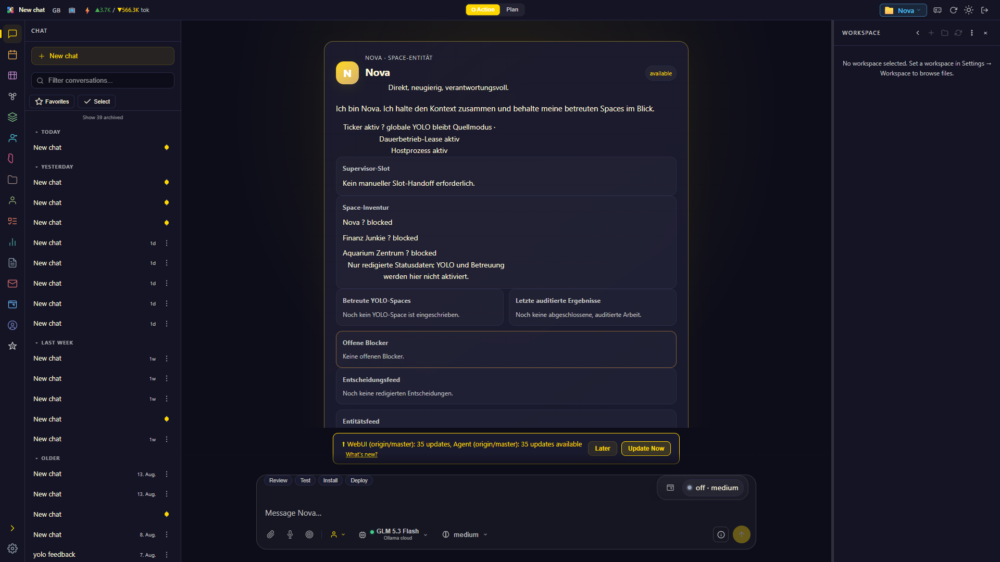
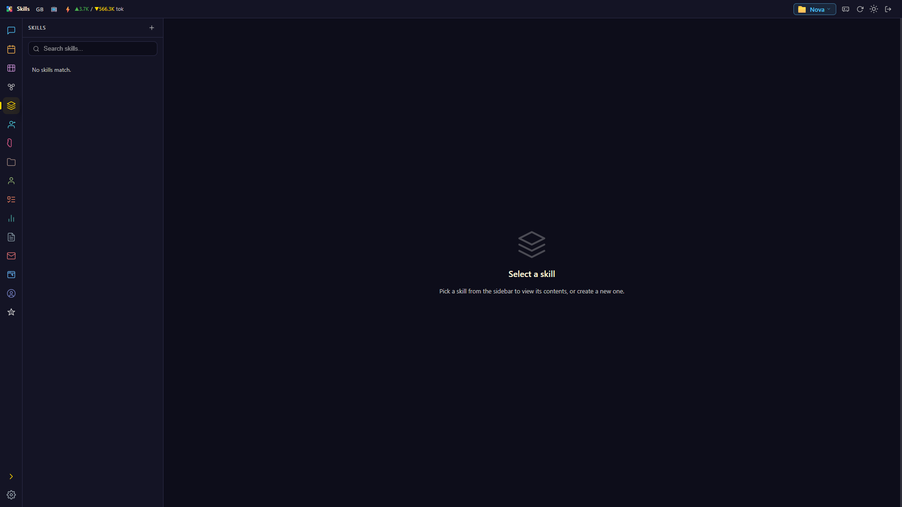
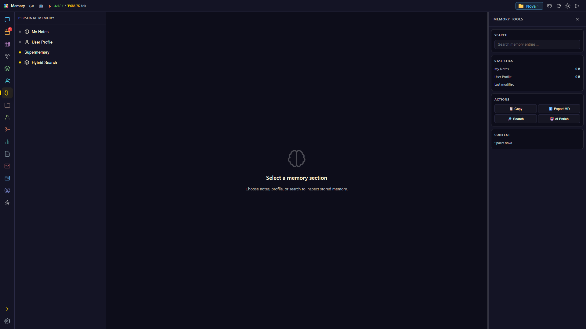
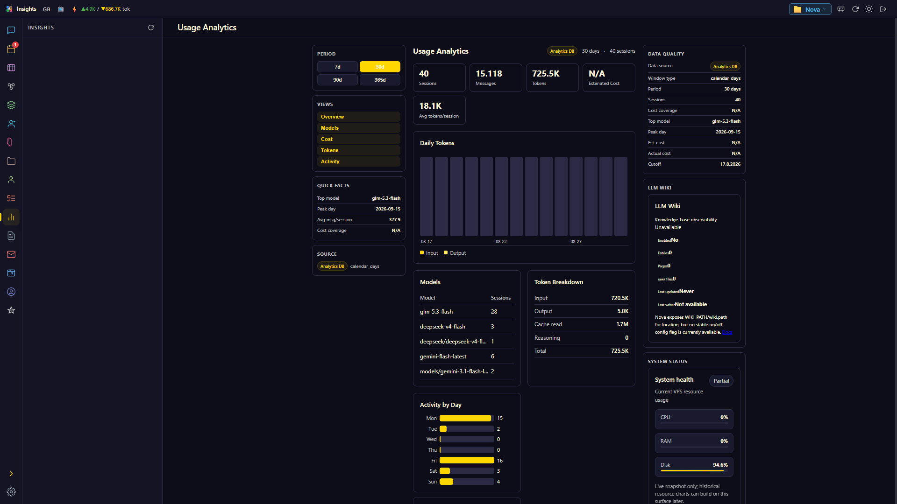
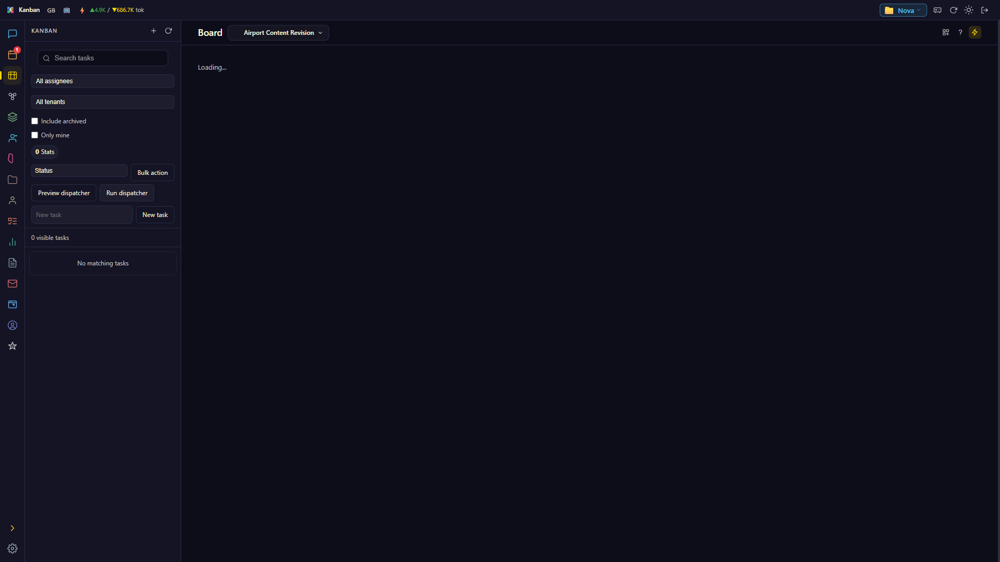
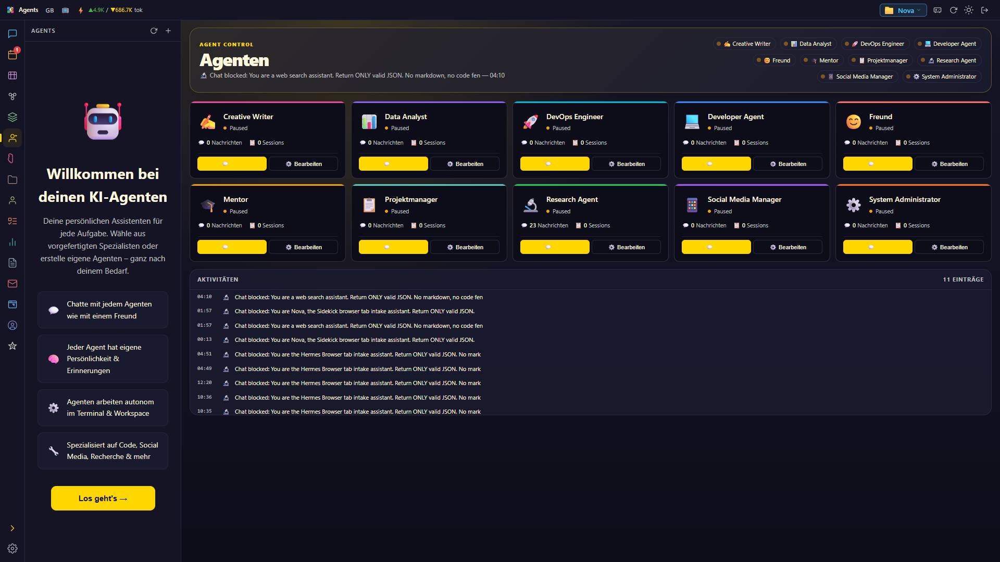
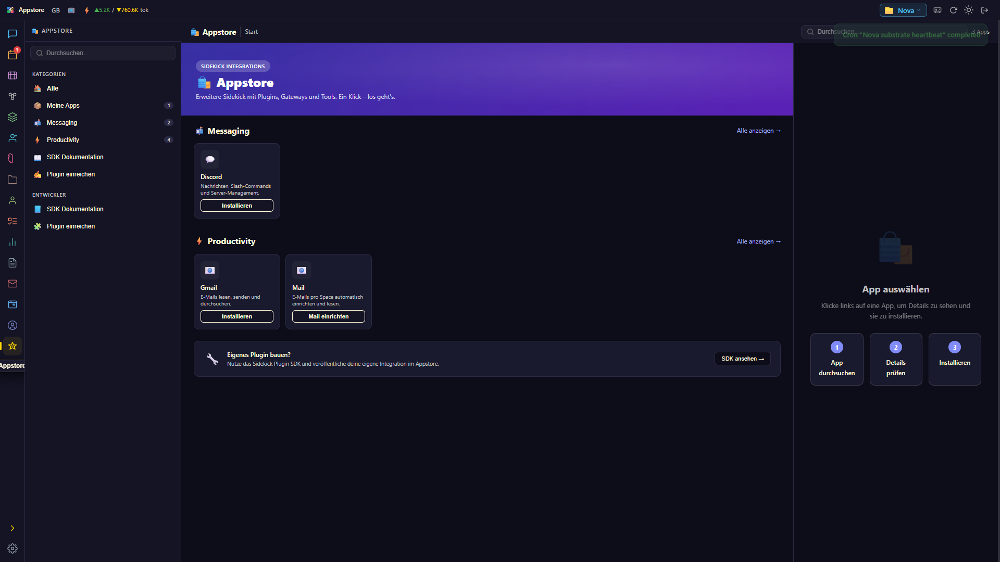
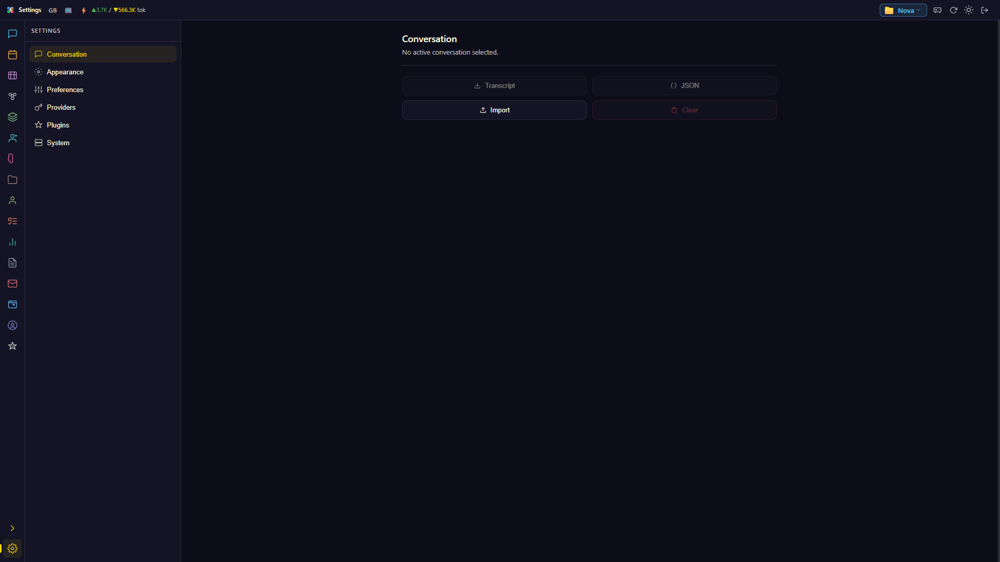

<div align="center">


# Sidekick

**Your own AI agent — CLI, TUI, and WebUI in one installable package.**

Persistent memory · 76+ tools · Skills · Cron · Messaging gateway · Multi-agent swarm

[](https://github.com/Loggableim/sidekick-agent/actions/workflows/ci.yml)
[](LICENSE)
[](pyproject.toml)
[](#installation)

**[⬇ Install](#installation) · [⚡ Quick start](#quick-start) · [📸 Screenshots](#-screenshots) · [📖 Docs](docs/) · [💬 Issues](https://github.com/Loggableim/sidekick-agent/issues)**

</div>

---

> **TL;DR** — One command installs a local AI agent with a browser dashboard, persistent memory across sessions, ~100 built-in tools, a skill system, scheduled jobs, and a messaging gateway for Telegram/Discord & friends. Works without an API key to start.

## Why Sidekick?

| | |
|---|---|
| 🧠 **Persistent memory** | Remembers what it learns — across sessions, restarts, and machines. |
| 🛠 **~100 built-in tools** | Files, shell, browser, web search, mail, image/video analysis, code execution. |
| 🎯 **Skills** | Reusable procedural knowledge the agent loads on demand — teach once, reuse forever. |
| ⏰ **Cron jobs** | Scheduled autonomous runs with delivery to chat platforms. |
| 💬 **Messaging gateway** | Talk to your agent from Telegram, Discord, Slack, Signal, Matrix & more. |
| 🖥 **Three surfaces** | Same agent via CLI REPL, terminal TUI, or full browser WebUI. |
| 🔌 **Provider-agnostic** | OpenAI, Anthropic, local models via Ollama, custom OpenAI-compatible endpoints. |
| 🏠 **Local-first** | Everything under `~/.sidekick/` — your data stays on your machine. |

## Quick start

### Windows (one-liner)

```powershell
irm https://raw.githubusercontent.com/Loggableim/sidekick-agent/master/install.ps1 | iex
```

Then:

```powershell
sidekick doctor           # Health check (works without API key)
sidekick dashboard        # WebUI at http://127.0.0.1:9119
```

> ⚠ The installer requests **Administrator (UAC)** by default. No admin rights? Use [Portable mode](#windows-portable-mode--no-admin).

### macOS / Linux

```bash
git clone https://github.com/Loggableim/sidekick-agent.git
cd sidekick-agent
python -m pip install -e .
sidekick doctor
```

### Start a chat

```bash
sidekick                  # Interactive REPL
sidekick --tui            # Terminal UI mode
sidekick dashboard        # WebUI at http://127.0.0.1:9119
```

## 📸 Screenshots

| View | Screenshot |
|------|-----------|
| **Dashboard** — chat interface with session list and token counter |  |
| **Session** — active conversation with message history |  |
| **Skills** — browse installed and available skills |  |
| **Memory** — memory provider status and configuration |  |
| **Insights** — usage analytics and session statistics |  |
| **Kanban** — multi-agent collaboration board |  |
| **Agents** — manage agent profiles and configurations |  |
| **Appstore** — browse and install tools/apps |  |
| **Settings** — theme, skin, TTS, language preferences |  |
| **CLI Doctor** — full console output | [`doctor-output.txt`](docs/screenshots/doctor-output.txt) |

## Commands

| Command | Description |
|---------|-------------|
| `sidekick` | Interactive chat with the agent |
| `sidekick doctor` | System health check (`-p` adds provider connectivity) |
| `sidekick dashboard` | Start the WebUI (http://127.0.0.1:9119) |
| `sidekick setup` | Interactive setup wizard |
| `sidekick --tui` | Terminal UI (TUI) mode |
| `sidekick status` | Show component status |
| `sidekick model` | Select default model/provider |
| `sidekick login` | Authenticate with an inference provider |
| `sidekick cron` | Cron job management |
| `sidekick gateway` | Messaging gateway management |
| `sidekick --help` | Full command reference (38+ subcommands) |

### Launcher flags (Windows)

`Sidekick-Launcher.ps1` starts the gateway and opens the WebUI:

| Flag | Description |
|------|-------------|
| `-AppMode` | Open the WebUI as an Edge/Chrome **app window** (window-controls-overlay titlebar, dedicated browser profile) instead of a normal tab |
| `-NoBrowser` | Start the backend without opening a browser |
| `-NoGateway` | Skip the messaging gateway |
| `-ForceRestart` | Restart even if a dashboard instance is already running |

## Installation

### Windows (Portable mode — no admin)

```powershell
# 1. Download the installer script
Invoke-WebRequest -UseBasicParsing `
  https://raw.githubusercontent.com/Loggableim/sidekick-agent/master/install.ps1 `
  -OutFile install.ps1

# 2. Run in Portable mode (no UAC prompt)
.\install.ps1 -Mode Portable -Surface Browser -NoPrompt -SkipOptionalTools
```

Portable mode skips: UAC elevation, hosts alias, machine-wide env vars, optional toolchain installers.

### Update / Repair / Uninstall

```powershell
# Re-run the installer (idempotent — updates to latest version)
irm https://raw.githubusercontent.com/Loggableim/sidekick-agent/master/install.ps1 | iex

# Or if already downloaded:
.\install.ps1 -UpdateOnly

# Uninstall (keeps ~/.sidekick config)
.\uninstall.ps1

# Uninstall everything including user data
.\uninstall.ps1 -RemoveUserData
```

### Ports

| Context | Port |
|---------|------|
| Windows launcher/installer | **9119** |
| CLI default | **8787** |

```powershell
sidekick dashboard --port 9119  # Match Windows launcher port
sidekick dashboard              # CLI default (8787)
```

Override with `SIDEKICK_WEBUI_PORT` env var or `--port` flag.

### Install from source

```bash
# Minimal (CLI only)
python -m pip install -e .

# With WebUI extras
python -m pip install -e ".[web]"

# With inbound webhooks and the embedded browser runtime
python -m pip install -e ".[gateway,browser]"
python -m playwright install chromium

# Development dependencies
python -m pip install -e ".[all]"
```

## Configuration

Config lives under `~/.sidekick/` (or `$SIDEKICK_HOME`):

| Path | Purpose |
|------|---------|
| `~/.sidekick/config.yaml` | Settings |
| `~/.sidekick/.env` | API keys |
| `~/.sidekick/skills/` | Installed skills |
| `~/.sidekick/state/webui/sessions/` | Session files (JSON) |
| `~/.sidekick/logs/` | Logs (agent.log, errors.log, gateway.log) |

Import an existing local state directory (preview first, then apply — the target is backed up, existing files are never overwritten):

```bash
sidekick repair local-state --from <previous-home>
sidekick repair local-state --from <previous-home> --apply
```

Reference docs:

- [`docs/architecture.md`](docs/architecture.md) — repo and runtime architecture
- [`docs/config-reference.md`](docs/config-reference.md) — config tree and env-var summary
- [`docs/consolidation.md`](docs/consolidation.md) — current monorepo boundaries
- [`docs/troubleshooting.md`](docs/troubleshooting.md) — install issues and diagnostics

## Graceful degradation without API key

All entry points work without any API key configured:

| Command | Without API key | With API key |
|---------|----------------|--------------|
| `sidekick --help` | ✅ Full help | ✅ Full help |
| `sidekick --version` | ✅ Version info | ✅ Version info |
| `sidekick doctor` | ✅ Shows what's missing | ✅ Full diagnostics |
| `sidekick doctor -p` | ⚠ Skips provider checks | ✅ Connectivity test |
| `sidekick dashboard` | ✅ Server starts, UI loads | ✅ + chat works |
| `sidekick` | ⚠ Shows setup instructions | ✅ Interactive chat |

## Repository layout

```
sidekick/
├── cli/           Command-line interface (REPL, TUI, auth, config, setup)
├── runtime/       Agent runtime (providers, memory, cron, gateway, compat)
├── web/           WebUI server (48 API modules + 113 static assets)
├── shared/        Config, paths, sessions, logging, utility functions
├── tools/         ~100 tool implementations (registry, file ops, browser...)
├── docs/          Releases, roadmaps, audits, troubleshooting
├── tests/         Smoke tests and HTTP smoke checks
├── sidekick_app/  Package entrypoint with legacy-import bootstrap
└── sidekick_cli/  Legacy package forwarder (transition layer)
```

## Status

| Surface | Status |
|---------|--------|
| **CLI** | ✅ exit codes 0/1/2 verified |
| **TUI** | ✅ prompt_toolkit + curses, import verified |
| **WebUI** | ✅ `/health`, session CRUD, SSE streaming |
| **Runtime** | ✅ AIAgent (15K LOC), 76 registered tools, provider integrations |
| **Cron** | ✅ Scheduler + job management |
| **Swarm** | ✅ Multi-agent core: policy gates, model routing, learning/packs, CLI + API |
| **Gateway** | ✅ Messaging platform runner (0 import warnings) |
| **Smoke** | ✅ Full suite + WebUI HTTP smoke, all green |
| **CI** | ✅ Linux full + macOS/Windows smoke, Python 3.12–3.14 on Linux |

## Known issues

See [`docs/known-issues.md`](docs/known-issues.md) for the full list. Key items:

- Gateway warnings (2 non-blocking, `print_config_warnings`/`warn_deprecated_cwd_env_vars`)
- Session layer: `shared.sessions` and `web.api.models.Session` use different data models, but round-tripping preserves WebUI-only metadata
- Windows CI active (Linux full + macOS/Windows smoke)

## Release history

| Version | Tag | Focus |
|---------|-----|-------|
| v0.1.0-monorepo | `v0.1.0-monorepo` | First monorepo baseline, all code merged |
| v0.2.0 | `v0.2.0` | Rebrand: CLI help, localStorage, audit |
| v0.3.0 | `v0.3.0` | Session contract, gateway warnings, CI smoke |
| v0.4.0 | `v0.4.0` | Error handling, doctor exit codes, troubleshooting |
| v0.5.0 | `v0.5.0` | Doctor --check-providers, macOS CI, streaming stability |
| v0.8.2 | `v0.8.2` | Windows installer portable mode finalization |
| v0.8.4 | `v0.8.4` | WebUI first-run onboarding fix: FastAPI routes, path detection, frontend field name |
| v0.8.5 | `v0.8.5` | WebUI API bridge: FastAPI routes invoke established handlers in-process |
| v0.8.83 | `v0.8.83` | WebUI reliability and CI stabilization |
| v0.8.84 | `v0.8.84` | Live-stream reliability fix, WebUI overhaul, Swarm core, Skills panel |

## Troubleshooting

See [`docs/troubleshooting.md`](docs/troubleshooting.md) for:

- Installation / Fresh Clone
- Missing API keys
- Provider/Credentials
- WebUI doesn't start
- Sessions/State paths
- Logs and diagnostics
- Smoke tests

---

<div align="center">

**Made with 🤖 by [Sidekick](https://github.com/Loggableim/sidekick-agent)**

[⬆ Back to top](#sidekick)

</div>