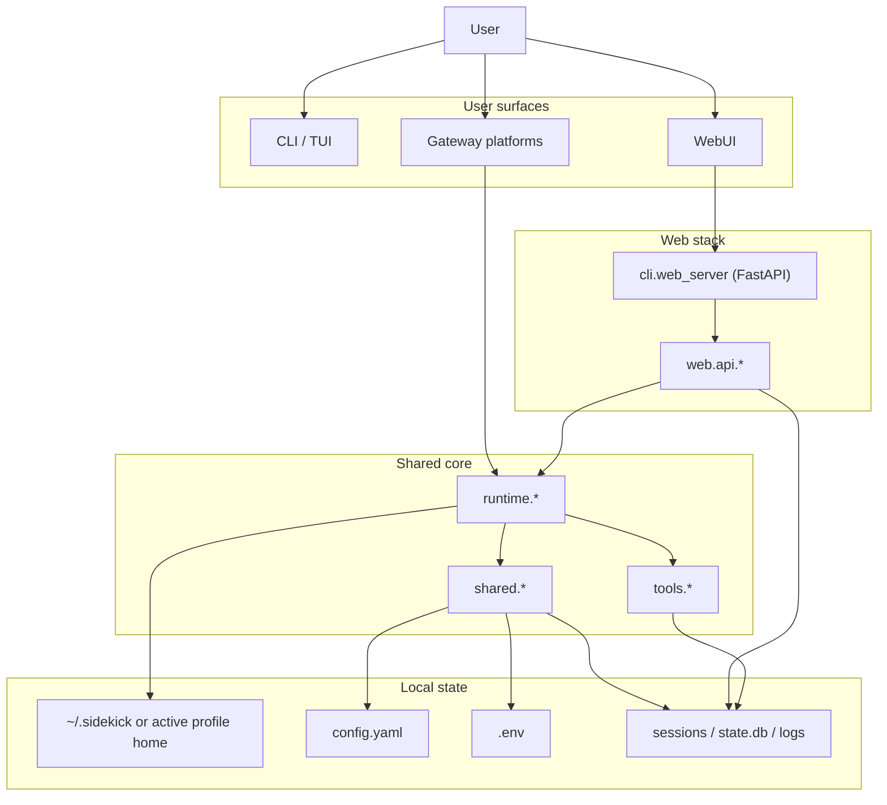
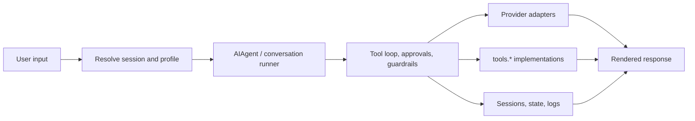

# Architecture

Sidekick is a single monorepo with one shared runtime and three primary user
surfaces:

- CLI and TUI for interactive work
- WebUI for browser-based work
- Gateway/runtime services for messaging platforms and background jobs

The main goal of this layout is consistency: the same provider logic, tool
registry, config system, and session storage are reused across all surfaces.

## Layer Map

## Request Flow

The important boundary is simple:

- `shared.*` owns basic config, paths, sessions, logging, and helper logic.
- `cli.*` owns the human entrypoints, commands, and setup flows.
- `cli.web_server` owns the single FastAPI/ASGI server and native WebUI routes.
- `web.api.*` owns the remaining HTTP route logic and WebUI-specific state
  handling; it is dispatched in-process by FastAPI while routes are converted
  incrementally.
- `runtime.*` owns the agent transport, providers, gateway, and background
  execution.
- `tools.*` owns concrete tool implementations that the agent can call.

## State And Paths

Sidekick keeps user state under the active home directory:

- `SIDEKICK_HOME` selects an explicit home.
- Otherwise Sidekick falls back to `~/.sidekick`.

The active home is profile-aware in the WebUI. That means a request can be
routed to a profile-specific home directory even when the process has a shared
default home.

Typical directories:

- `config.yaml` for settings
- `.env` for secrets and provider tokens
- `sessions/` and `state.db` for conversation state
- `logs/` for runtime logs
- `skills/` for installed skills

## Session Model

There are still two session models in the repository:

- `shared.sessions.Session` is the lightweight shared/session layer.
- `web.api.models.Session` is the richer WebUI-facing session object.

They share the same storage roots. `shared.sessions` now preserves unknown
WebUI metadata fields when sessions are loaded and saved, so cross-surface
round-trips do not drop extra JSON keys. The object shapes are still not
identical yet, and that is documented in `docs/known-issues.md`.

## Where To Edit What

If you need to change:

- CLI commands, auth, setup, doctor, or shell integration -> `cli/*`
- WebUI routes, dashboard behavior, or API responses -> `cli/web_server.py`
  and `web/api/*`
- Provider selection, agent execution, cron, or gateway behavior ->
  `runtime/*`
- Shared defaults, paths, or simple config helpers -> `shared/*`
- Tool behavior -> `tools/*`
- Application bootstrap -> `sidekick_app/*`

## Related Docs

- `docs/config-reference.md`
- `docs/consolidation.md`
- `docs/known-issues.md`
- `docs/release-checklist.md`
