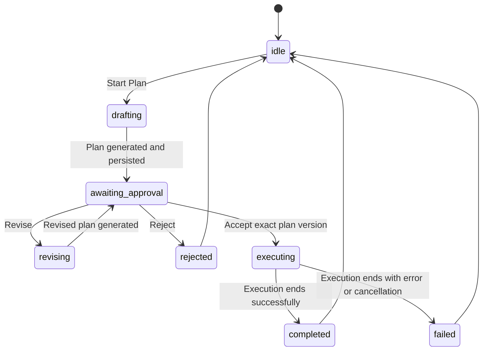

# Sidekick Superpowers Workflow Design

**Status:** Approved for planning  
**Date:** 2026-07-15  
**Scope:** Sidekick CLI, TUI, WebUI, runtime, and bundled skills

## Purpose

Make Sidekick's skill and coding workflow feel coherent across its supported surfaces. A user must be able to request a plan, review or revise it, explicitly authorize implementation, and receive a verified result without relying on a model prompt alone to prevent mutations.

The feature adopts the useful operating model of the Superpowers workflow while remaining Sidekick-native: its skills use Sidekick tools and conventions, its state is profile-aware, and its safety controls run in Sidekick's runtime rather than in copied Codex-only instructions.

## Goals

1. Ship all fourteen Superpowers workflow skills as a versioned, discoverable `superpowers/` bundle:
   - brainstorming
   - dispatching-parallel-agents
   - executing-plans
   - finishing-a-development-branch
   - receiving-code-review
   - requesting-code-review
   - subagent-driven-development
   - systematic-debugging
   - test-driven-development
   - using-git-worktrees
   - using-superpowers
   - verification-before-completion
   - writing-plans
   - writing-skills
2. Make those skills first-class Sidekick skills in every normal agent surface. They are listed, loadable, and invocable by slash command without a machine-local dependency on a Codex installation.
3. Provide one durable Plan/Execute workflow for the WebUI, CLI, and TUI.
4. Enforce Plan Mode in the tool runtime. A prompt that says "do not execute" is not sufficient protection.
5. Require explicit approval of the exact current plan before an Execute turn begins.
6. Preserve existing Sidekick approvals, workspace restrictions, profile isolation, streaming, goal tracking, and session behavior.

## Non-goals

- Replacing Sidekick's existing Skills Hub or generic skill format.
- Enabling autonomous writes simply because a plan exists.
- Automatically dispatching parallel agents for every plan.
- Copying Codex-specific configuration, app directives, or tool names into Sidekick verbatim.
- Changing unrelated Kanban dispatch hardening already present in the worktree.

## Product Model

### Workflow state

Each Sidekick session has at most one active workflow record, stored under the active profile home so it survives browser refreshes, process restarts, and a switch between WebUI and CLI/TUI.

The record owns the following contract:

```text
mode: plan | execute
phase: idle | drafting | awaiting_approval | revising | executing | completed | rejected | failed
plan_id: opaque identifier
version: monotonically increasing revision number
request: original user request
plan_markdown: latest proposed plan
created_at / updated_at
approved_at / approved_by
execution_stream_id
```

`plan_id` and `version` are mandatory for accept and revise requests. The server rejects a stale or already-resolved approval rather than executing a different plan than the one the user reviewed.

Workflow persistence is separate from the two existing session object shapes. It is keyed by Sidekick profile home and session ID, with atomic writes and per-session locking. Session history still shows the human-readable plan and execution turns.

### Modes and transitions



An ordinary Action request remains supported for backwards compatibility. The prominently exposed coding flow is Plan followed by Execute, and the Execute control is unavailable for a plan until the server marks that plan version approved.

## Plan Mode enforcement

The workflow binds its mode into request-local runtime context before `AIAgent` starts. A centralized workflow guard evaluates every tool call before its handler runs.

In Plan Mode:

- Read-only inspection and analysis tools are allowed, including repository search, file reads, status inspection, skill discovery, and safe web research.
- All state-changing operations are denied before dispatch: writes, patches, terminal commands, code execution, package installs, network mutations, publishing, messaging, deployments, skill mutation, browser actions that submit or change state, and delegation that can mutate state.
- The agent receives an explicit structured denial explaining that it must return a plan or ask for clarification. It cannot bypass the guard by calling a lower-level tool or `execute_code`.

In Execute Mode:

- Normal Sidekick permission, workspace, checkpoint, and approval controls remain authoritative.
- The runtime verifies that the execution turn is associated with an approved current plan. A direct old or forged `plan_id` is rejected.

The mode instruction remains in the system prompt for good model behavior, but the guard is the source of truth.

## Surface design

### WebUI

- Replace the ambiguous Plan/Action coding interaction with clearly named **Plan** and **Execute** modes while retaining an Action-compatible fallback for conversational work.
- Starting Plan sends a workflow request, streams read-only research and the proposed plan, then emits a structured `workflow`/`plan` SSE event from server state.
- A plan card renders the server-issued plan ID and version. It offers **Accept & Execute**, **Revise**, and **Reject**.
- Accepting a plan sends its ID and version and starts the execution stream only after the server confirms the state transition.
- Revising starts another Plan Mode turn, not an Action/Execute turn. The replacement plan receives a higher version and invalidates the old approval.
- Reloading a session restores the current plan card and phase from durable workflow state, rather than relying on client-only `_activePlan` fields.
- Status strips and stream reconnects show the current phase and link it to the relevant session.

### CLI and TUI

- Add `/plan <request>` to enter the same Plan Mode flow.
- Add `/plan revise <feedback>` and `/plan reject` to operate on the active plan.
- Add `/execute` to execute the latest approved plan for the session, and `/execute <plan-id>` only when that exact plan is still approved.
- The text renderer prints the workflow phase, plan version, and the exact command needed to proceed. It never silently switches a planning turn into execution.

### Gateway and background surfaces

The skill bundle is discoverable everywhere. Plan/Execute commands are accepted only where a session can safely receive and acknowledge an explicit approval. Scheduled and background work remain subject to their existing non-interactive approval policy and cannot use an implicit approval.

## Superpowers skill bundle

The repository owns Sidekick-adapted `SKILL.md` packages under `skills/superpowers/`. They keep the intent and sequencing of the fourteen workflows, but use Sidekick terminology and tools:

- `skill_view`, `skills_list`, and Sidekick Skills Hub replace Codex-only skill plumbing.
- Sidekick workspaces, `sidekick` CLI, and the WebUI/TUI replace app-specific Codex directions.
- The worktree skill uses Sidekick's workspace isolation and safe Git checks.
- The planning and execution skills use the durable workflow contract above rather than ad-hoc prompt text.
- The testing and verification skills require current command output before completion claims.

The bundle is shipped as built-in content and indexed through the existing skill discovery path. The active profile may disable individual skills using existing skill configuration; it does not need an `external_dirs` reference to the developer's Codex cache.

## API and streaming contract

The WebUI receives dedicated workflow endpoints instead of generic prompts pretending to be a workflow:

```text
POST /api/workflows/plan
POST /api/workflows/{plan_id}/revise
POST /api/workflows/{plan_id}/approve
POST /api/workflows/{plan_id}/reject
GET  /api/workflows/session/{session_id}
```

All mutating endpoints require session ownership, the active profile context, trusted workspace resolution, and compare the submitted plan version with the stored version. Their stream response uses the existing stream registration path.

The server emits a `workflow` SSE event for phase changes and a `plan` event when a draft is ready. Existing consumers may continue to handle `plan`; its payload is now authoritative and includes `plan_id`, `version`, `phase`, and `text`.

## Error handling

- A blocked Plan Mode tool call returns an explicit non-retryable workflow error with the blocked tool name and the reason.
- An accept/revise request with a missing, stale, rejected, or already-executing plan returns a conflict response with the current phase/version.
- A browser reconnect restores the persisted workflow state and then resumes the normal stream-reconnect behavior.
- An interrupted or failed execution transitions to `failed`, keeps the plan and result history visible, and lets the user begin a new plan or request a revision.
- A malformed or unavailable workflow store fails closed for execution; Sidekick must not run an unverified plan.

## Testing and acceptance criteria

The implementation is complete only when all of the following are demonstrated:

1. Every bundled Superpowers skill is discoverable, loadable, profile-aware, and available from the normal skill prompt/index.
2. A Plan Mode turn can use allowed inspection tools but cannot write a file, patch content, execute a command, invoke `execute_code`, install/publish, or mutate through browser/delegated tools.
3. A generated plan is persisted with a server-issued ID/version, emitted over SSE, and remains visible after session reload.
4. Revision increments the plan version, invalidates a prior approval, and stays inside Plan Mode.
5. Execute rejects missing or stale approval and, after a valid approval, starts exactly one normal execution stream with normal Sidekick approvals intact.
6. CLI/TUI commands operate on the same state as WebUI and do not create a parallel, incompatible workflow.
7. Existing plan handler, profile-routing, workspace, streaming, skills, and focused WebUI tests remain green.
8. A real local WebUI smoke flow validates mode selection, plan card creation, plan acceptance, and visible execution status.

## Rollout

The feature will be introduced behind a `workflows` configuration block enabled by default for fresh installs and upgrade-safe for existing profiles. The previous composer preference migrates to an Action-compatible value. Removing or disabling workflows leaves ordinary Sidekick chat and existing approvals operational.

